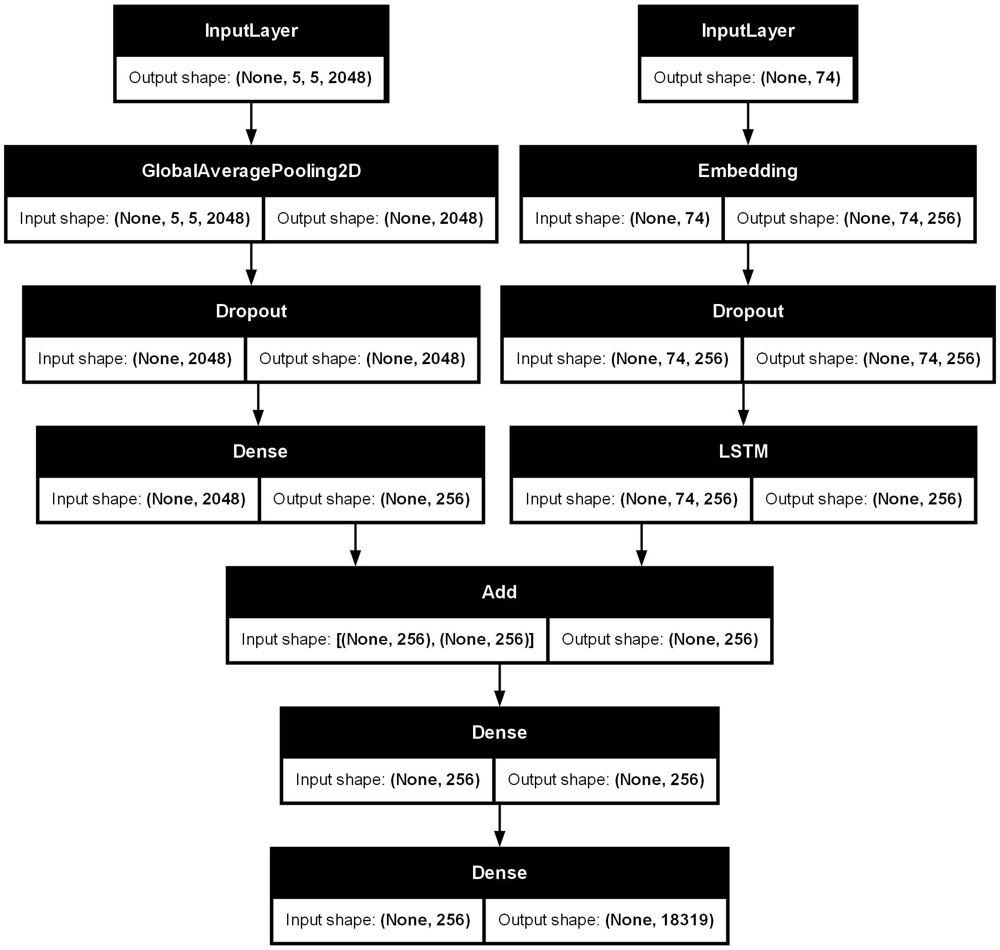
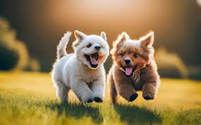

# Image captioning using CNN-LSTM

This project implements an image captioning model that uses CNN for feature extraction and LSTM network for generating natural language description of simple images.

## Model architecture
The LSTM network of the model has ~10M trainable parameters, and follows the below architecture:
<p align="center">
  
  <br>
  <em><b>Model architecture</b></em>
</p>

## Training

The model uses Inception network for feature extraction, and the LSTM network was trained on the [Flickr30k dataset](https://www.kaggle.com/datasets/eeshawn/flickr30k) using the Adam optimizer.

## Installation

1. Clone the repository:
    ```sh
    git clone https://github.com/nikhil-405/image-captioning.git
    cd image-captioning
    ```
2. Install the required dependencies:
    ```sh
    pip install -r requirements.txt
    ```
3. Download the trained LSTM network from [here](https://huggingface.co/nikhil-405/image-captioning/tree/main).

## Usage

After installation, you can simply use the model by running the [inference notebook](inference.ipynb)

## Results

Here are some example results generated by the model:

<p align="center">
  
  <br>
  <em>Generated Caption: two dogs are running through the grass</em>
</p>

<p align="center">
  
  <br>
  <em>Generated Caption: man in blue shirt is sitting on bench</em>
</p>

## Contributors

- [nikhil-405](https://github.com/nikhil-405)

## License

This project is licensed under the MIT License. See the [LICENSE](LICENSE) file for details.
